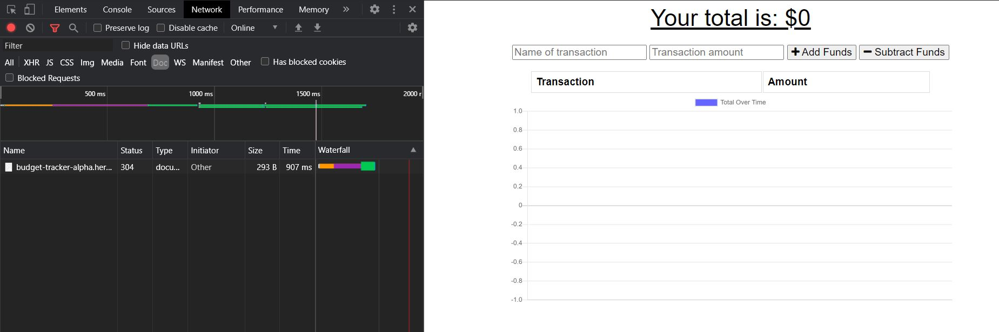
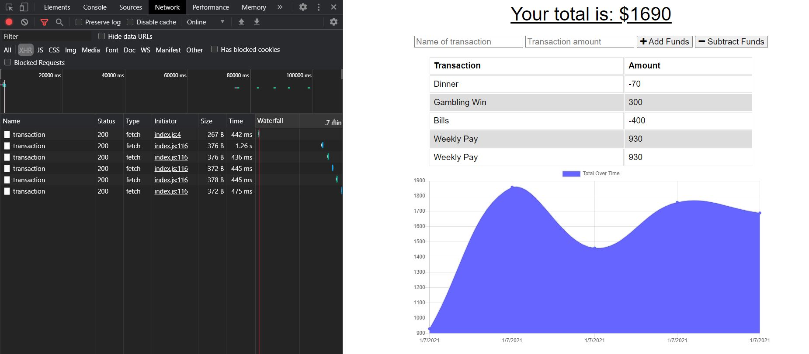
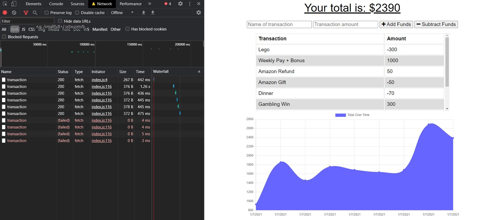

# BudgetTracker

<br />

## Description

A simple budget tracker with offline/online refresh interactions

## Contents

- [Installation](#installation)
- [User Story](#user-story)
- [Usage](#usage)
- [Demonstration](#demonstration)
- [Screenshots](#screenshots)
- [Questions](<#questions-(FAQ)>)
- [Contact](#contact)
- [Author](#authors)
- [Acknowledgements](#acknowledgements)

## Installation

#### Requirements:

1. MongoDB
2. Nodejs

#### To install Workout Tracker app:

1. Ensure you have a MongoDB Atlas account (and set up a cluster to connect to).
2. Clone this repo to your local machine.
3. Change the mongoose connection string details in server.js to your connection details or create a .env file in the root directory of the application - then add <addr>MONGODB_URI=mongoapplication<addr>, replacing "mongoapplication" with the connection string to your database
4. Run `npm i` to install dependencies.
5. Run `npm start` and navigate to https://localhost:7000 to view the application.

## User Story

```
As a user, I want to be able to track my expenses and maintain a budget. I should be able to track the my transactions both online AND offline, incase I do not have an internet connection available. The budget tracker should update once I go back online.
```

## Usage

1. Run `npm start` to start the application.
2. Enter a name for the transaction and an amount.
3. Click "+Add Funds" or "-Subtract Funds" to submit the specific transaction.

## Demonstration

- [Deployed Application](https://budget-tracker-alpha.herokuapp.com)

## Tests

- No included tests for this application.

## Screenshots

_The application before use_



_Adding transactions while online_



_Adding transaction while offline_



## Questions

- Submit questions to my contact details below.
- App is hosted on Heroku.

## Contact

- Contact me with any questions on my email: agre.fun21@gmail.com or silver.grech@gmail.com

## Author

- Initial front end files to develop by Trilogy Education Services
- Andr&eacute; Grech - 7/01/2021

### Acknowledgements

- © 2019 Trilogy Education Services, a 2U, Inc. brand. All Rights Reserved.
